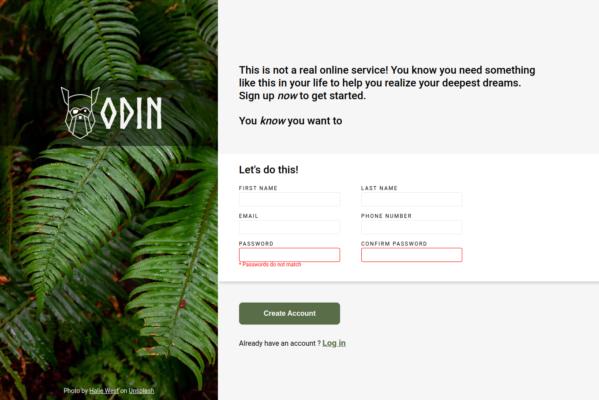

# Sign-Up Form

A sign-up form build using flexbox

[Live Preview](https://vsilagy.github.io/sign-up-form/)

## Built with:

- HTML
- CSS

### **The Odin Project**: [Sign-Up Form](https://www.theodinproject.com/lessons/node-path-intermediate-html-and-css-sign-up-form)

#### Objectives:

- build a sign-up-form following the assignment design

##### Assignment Design

##### My Version

